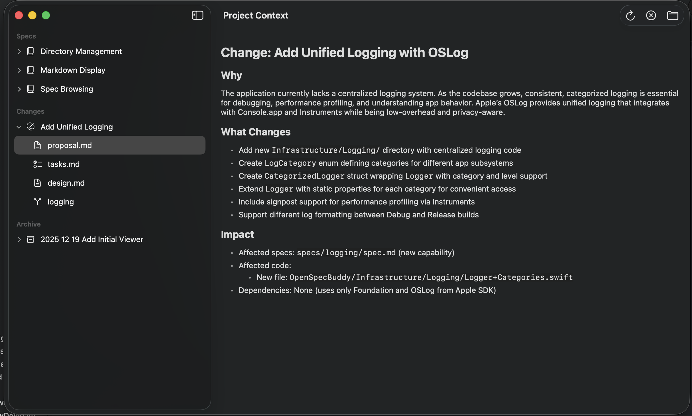

# 🔍 OpenSpec Buddy

A native macOS viewer for [OpenSpec](https://github.com/Fission-AI/OpenSpec) projects — browse your specs, changes, and archives with ease.

## ✨ Features

- 📂 **Directory Browser** — Open any OpenSpec project folder
- 📋 **Specs Viewer** — Browse your source-of-truth specifications
- ✏️ **Changes Tracker** — View active proposals, tasks, and spec deltas
- 🗄️ **Archive Explorer** — Review completed changes
- 🔖 **Recent Directories** — Quick access to your projects
- 📝 **Markdown Rendering** — Beautiful display of all your `.md` files

## 📸 Screenshot

  

## 🚀 Getting Started

1. Clone the repo
2. Open `OpenSpecBuddy.xcodeproj` in Xcode
3. Build and run (⌘R)
4. Click "Open Directory" and select a folder containing an `openspec/` directory

## 🛠️ Requirements

- macOS 15.0+
- Xcode 16+

## 📄 License

MIT
